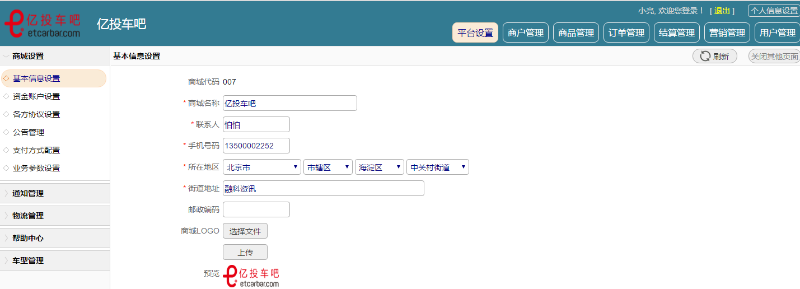

# starfish-mall
分布式商城项目

项目参考2015年的020汽车服务电商网站——“亿投车吧”项目（当然，早就黄了），自己整合修改了一下，单纯的学习。

## 项目介绍
项目采用Maven结构，传统分布式架构，主要分为网站前端，后台管理系统两部分。
#### 开发环境
Redis(缓存)、ActiveMQ（消息队列）、Nginx（文件服务器）、ElasticSearch（搜索）、Shiro（安全管理）、MySQL、Maven、Jetty(或Tomcat)、IDEA
#### 软件架构
Spring、MyBatis 、Freemarker 

##### 软件依赖环境下载：https://download.csdn.net/download/u011870547/10327777
## 网站效果

## 项目搭建和配置

 

